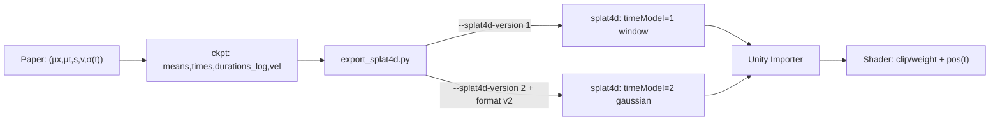

# 规格: FreeTimeGS 的(µx,µt,s,v,σ(t))到`.splat4d v1/v2`的映射

## 目的
把 FreeTimeGS 论文里的 4D 高斯定义,和我们工程里的三件事对齐:

- 训练(ckpt 里到底存了什么语义).
- 导出(`tools/exportor/export_splat4d.py` 写入的字段语义).
- Unity runtime(Importer + shader 如何解释 time/duration/velocity).

目标是避免后续反复口头对齐,以及避免把`.splat4d-version`和`.splat4d-format-version`混为一谈.

## 范围与非目标

范围:
- 只覆盖 FreeTimeGS 的时间核(temporal opacity)与线性运动(motion)相关字段.
- 覆盖`.splat4d`的两种 timeModel 语义:
  - v1: window(time0 + duration).
  - v2: gaussian(mu + sigma).

非目标:
- 不讨论 SH rest 的 delta-v1 编码细节(那是另一个 spec).
- 不讨论如何从视频抽帧/跑 COLMAP/三角化(见`specs/mp4_to_4dgs_pipeline.md`).

## 来源(证据)

### 论文(FreeTimeGS, CVPR 2025)
我们只引用短句(避免长段落复制).

- Abstract: "allows Gaussian primitives to appear at arbitrary time and locations."
- Sec 3.1: "Gaussian primitives that can appear at any spatial position and time step."
- Eq.(1): `µx(t) = µx + v · (t − µt)`
- Eq.(4): `σ(t) = exp(-1/2 * ((t-µt)/s)^2)`

### 本仓库实现(FreeTimeGsVanilla)
- trainer: `src/simple_trainer_freetime_4d_pure_relocation.py`
  - `compute_positions_at_time()`与`compute_temporal_opacity()`是“权威口径”.
- exporter: `tools/exportor/export_splat4d.py`
  - `--splat4d-version`决定 time/duration 的语义(window vs gaussian).
  - `--splat4d-format-version`决定文件是否带 v2 header(legacy vs header+sections).

### 关联项目(Unity, gsplat-unity)
路径以`/workspace/gsplat-unity`仓库为根.

- importer: `Editor/GsplatSplat4DImporter.cs`
- runtime asset: `Runtime/GsplatAsset.cs`
- runtime shader: `Runtime/Shaders/Gsplat.shader`

## 术语与符号
- `t`: 归一化时间,范围通常是`[0, 1]`.
- `µx`: Gaussian 在 canonical time 的空间中心(位置).
- `µt`: Gaussian 最“可见”的时间中心.
- `v`: 线性速度向量(单位随时间标尺而定).
- `s`: 时间核宽度(论文里是 sigma,必须为正).
- `σ_base`: 基础不透明度(与时间无关).
- `σ(t)`: temporal opacity,是一个关于时间的权重函数.

## FreeTimeGS 的核心公式(训练侧口径)

1) 运动(线性):

`µx(t) = µx + v · (t − µt)`

2) 时间核(高斯):

`σ(t) = exp(-1/2 * ((t-µt)/s)^2)`

3) 合成不透明度(用于渲染):

`opacity(t) = sigmoid(opacities_logit) * σ(t)`

对应实现:
- `src/simple_trainer_freetime_4d_pure_relocation.py:1932`
- `src/simple_trainer_freetime_4d_pure_relocation.py:1944`

## ckpt 里字段的真实语义(非常关键)

在我们的 ckpt(`ckpt_*.pt`)里,核心字段是:

- `means`: `µx`,并且它语义上是“在`µt`时刻的中心”.
- `times`: `µt`,归一化时间.
- `durations`: **log(sigma)**,也就是`log(s)`.
  - trainer 会用`exp(durations)`得到`s`并在 runtime 计算中使用.
- `velocities`: `v`,单位是`meters/normalized_time`(即`t`从 0 到 1 的总位移尺度).

对应证据:
- exporter 读取注释: `tools/exportor/export_splat4d.py:1285`到`tools/exportor/export_splat4d.py:1292`
- trainer 的 temporal opacity: `s = exp(self.splats["durations"])`,见`src/simple_trainer_freetime_4d_pure_relocation.py:1938`

## `.splat4d`里的 4D 字段(记录层)

record 里和时间相关的字段是:

- `position`: float3
- `velocity`: float3
- `time`: float32
- `duration`: float32

Unity runtime 的解释方式在 shader 里是“事实来源”,简化后等价于:

- `pos(t) = position + velocity * (t - time)`
- timeModel=1(window): `visible iff time <= t <= time + duration`
- timeModel=2(gaussian): `w = exp(-0.5 * ((t-time)/max(duration,eps))^2)`,并把`opacity *= w`

证据:
- `Runtime/Shaders/Gsplat.shader:123`到`Runtime/Shaders/Gsplat.shader:175`
- `Runtime/Shaders/Gsplat.compute:60`到`Runtime/Shaders/Gsplat.compute:90`

## 映射规则

下面的表格是这份 spec 的核心.

| FreeTimeGS 概念 | ckpt 字段 | `.splat4d v1(window)`写入 | `.splat4d v2(gaussian)`写入 | Unity runtime 行为 |
| --- | --- | --- | --- | --- |
| 位置中心`µx` | `means` | 写`pos0 = µx + v*(t0-µt)` | 直接写`µx` | `pos(t)=pos+v*(t-time)` |
| 时间中心`µt` | `times` | 用它算窗口起点`t0` | 直接写`µt` | window: 裁剪; gaussian: 参与权重 |
| 时间宽度`s` | `exp(durations)` | 用它算窗口半宽 | 直接写`sigma=s` | gaussian: `sigma=max(duration,eps)` |
| 速度`v` | `velocities` | 直接写`v` | 直接写`v` | `pos(t)`里线性外推 |
| 时间核`σ(t)` | 运行时计算 | 近似成硬窗口 | 用 cutoff 裁掉小权重 | window: 0/1; gaussian: 连续权重 |

### v1(window): 用阈值把高斯核近似成硬窗口

给定`temporal_threshold in (0,1)`:

- `halfWidthFactor = sqrt(-2 * ln(temporal_threshold))`
- `halfWidth = sigma * halfWidthFactor`
- `t0 = clamp(µt - halfWidth, 0, 1)`
- `t1 = clamp(µt + halfWidth, 0, 1)`
- `duration = clamp(t1 - t0, 0, 1)`
- `pos0 = µx + v * (t0 - µt)`  (把位置从`µt`平移到`time0=t0`)

写入 record:
- `time = t0`
- `duration = duration`
- `position = pos0`
- `velocity = v`

证据:
- `tools/exportor/export_splat4d.py:1379`到`tools/exportor/export_splat4d.py:1391`

### v2(gaussian): 直接表达论文时间核

写入 record:
- `time = µt`
- `duration = sigma = exp(log_sigma)`(并 clamp `min_sigma`)
- `position = µx`(它本来就是`µt`时刻的位置)
- `velocity = v`

证据:
- `tools/exportor/export_splat4d.py:1610`到`tools/exportor/export_splat4d.py:1613`

## `.splat4d-format-version`与 timeModel 的关系(高频误用点)

这两者是正交概念:

- `--splat4d-version` -> timeModel 语义(window vs gaussian).
- `--splat4d-format-version` -> 文件是否带 v2 header.

关键事实:
- legacy 无 header 的`.splat4d`很难让 importer “可靠识别”timeModel=2.
- 因此 exporter 默认提供`--splat4d-format-version 0=auto`.
  - 当`--splat4d-version=2`或`--sh-bands>0`时,auto 会选择 format v2(header+sections).

证据:
- `tools/exportor/export_splat4d.py:1228`到`tools/exportor/export_splat4d.py:1241`

## Unity runtime 的最终解释(以 shader 为准)

当资产包含 4D 字段时(`_Has4D != 0`):

- window(timeModel=1):
  - `if (t < t0 || t > t0 + dt) discard`
  - `pos(t) = pos0 + v * (t - t0)`
  - opacity 不乘权重(因为是硬裁剪).
- gaussian(timeModel=2):
  - `w = exp(-0.5 * ((t-mu)/sigma)^2)`
  - `if (w < cutoff) discard`
  - `pos(t) = mu_x + v * (t - mu_t)`
  - `opacity *= w`实现平滑淡入淡出.

证据:
- `Runtime/Shaders/Gsplat.shader:123`到`Runtime/Shaders/Gsplat.shader:175`

## Flowchart(把链路画出来)

## 常见坑(建议写在心里)
- `durations`在 ckpt 里是`log(sigma)`,不是`sigma`.
  - 任何导出/运行时都必须先`exp()`再当作`sigma`.
- v1(window)如果不把`position`平移到`time0`,Unity shader 的`pos+vel*(t-time0)`会产生轨迹偏移.
- velocity 单位一定要对齐 normalized time.
  - NPZ 里常见是米/帧,trainer/exporter 期望是米/归一化时间.
