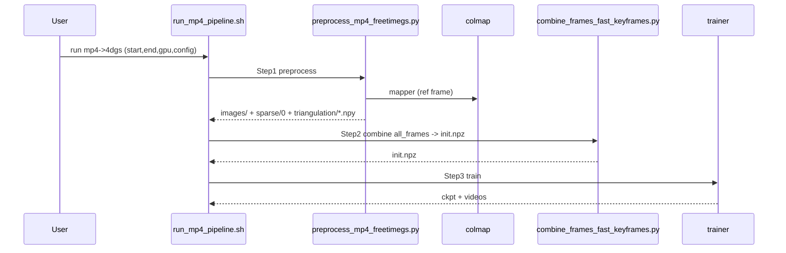

# 规格: mp4->4DGS 全流程(RoMA 全帧初始化)

## 目的
把"每路相机一个 mp4"的原始输入,变成 FreeTimeGsVanilla 可直接训练的 4D Gaussians 数据.
同时把数据流和调用链画清楚.
后续排障时不靠记忆.

## 输入与产物

### 输入
- `mp4_dir/*.mp4`: 每路相机一个 mp4.
  - 约定: 文件名 stem 作为相机名,例如 `cam01.mp4` -> `cam01`.

### 产物(默认只保留必要)
- `data_dir/images/<cam>/%06d.jpg`: 抽帧后的多相机图片序列.
- `data_dir/sparse/0/`: 参考帧跑 COLMAP 得到的静态相机位姿(内参+外参).
- `triangulation_dir/points3d_frame%06d.npy`: 每帧三角化点云(世界坐标).
- `triangulation_dir/colors_frame%06d.npy`: 每帧点云颜色(从 anchor 相机采样).
- `init_npz_path`: combine 后的初始化 NPZ(全帧 positions/colors/times/velocities/durations).
- `result_dir/ckpts/ckpt_30000.pt`: 训练产物 checkpoint.
- `result_dir/videos/*.mp4`: 训练过程导出的渲染视频(用于快速验证).

## 关键约定(必须一致)
- 帧范围语义: `[start_frame, end_frame)`(end exclusive).
  - `total_frames = end_frame - start_frame`.
- 相机位姿假设: 静态.
  - 只在 `reference_frame` 跑一次 COLMAP.
  - 其它帧复用 `data_dir/sparse/0` 的相机参数.
- anchor camera 选择: 按相机名排序后的第 0 个.
- time 归一化:
  - `time = (frame_idx - start_frame) / max(total_frames - 1, 1)`.

## Flowchart(数据流)

```mermaid
flowchart LR
  Mp4["mp4_dir/*.mp4"] -->|extract frames| Images["data_dir/images/<cam>/%06d.jpg"]
  Images -->|reference_frame symlink| RefImgs["work_dir/colmap_ref/images/<cam>.jpg"]
  RefImgs -->|colmap mapper| Sparse0["data_dir/sparse/0"]

  Images -->|per-frame| RomaTri["RoMA match + triangulate"]
  Sparse0 -->|static pose| RomaTri
  RomaTri --> Npy["triangulation_dir/*_frame%06d.npy"]

  Npy -->|combine all_frames| InitNPZ["init.npz"]
  InitNPZ -->|train paper_stratified_small| Train["trainer"]
  Images --> Train
  Sparse0 --> Train

  Train --> Ckpt["ckpt_30000.pt"]
  Train --> Videos["videos/*.mp4"]
```

## sequenceDiagram(调用时序)

## 常见失败点(用于排障)
- 抽帧失败:
  - 任一路相机读不到指定帧,必须直接报错(不要静默跳过),否则多视角会错位.
- COLMAP 失败:
  - 特征/匹配不足或场景纹理弱会导致 mapper 无法重建.
  - 需要先确认参考帧多相机覆盖足够且曝光一致.
- RoMA 三角化点云异常:
  - 外点太多会导致点云"飘"或深度为负,需要更严格的 RANSAC 或更小的采样阈值.
  - 先检查 anchor 相机与其它相机的匹配数和 inlier 比例.
